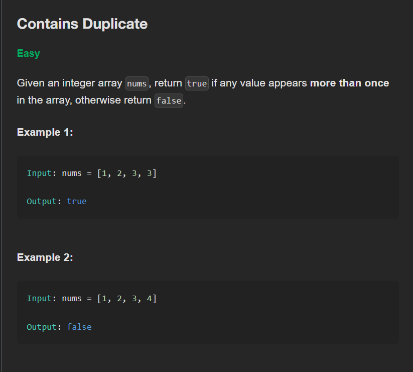

### Product of Array Except Self | Medium |

[

[

[

[

[

[

[

[

[

[

### Valid Sudoku | Medium |  
### Longest Consecutive Sequence | Medium |  
### Valid Palindrome | Easy |  
### Two Sum II Input Array Is Sorted | Medium |  
### 3Sum | Medium |  
### Container With Most Water | Medium |  
### Trapping Rain Water | Hard |  
### Best Time to Buy And Sell Stock | Easy |  
### Longest Substring Without Repeating Characters | Medium |  
### Longest Repeating Character Replacement | Medium |  
### Permutation In String | Medium |  
### Minimum Window Substring | Hard |  
### Sliding Window Maximum | Hard |  
### Valid Parentheses | Easy |  
### Min Stack | Medium |  
### Evaluate Reverse Polish Notation | Medium |  
### Generate Parentheses | Medium |  
### Daily Temperatures | Medium |  
### Car Fleet | Medium |  
### Largest Rectangle In Histogram | Hard |  
### Binary Search | Easy |  
### Search a 2D Matrix | Medium |  
### Koko Eating Bananas | Medium |  
### Find Minimum In Rotated Sorted Array | Medium |  
### Search In Rotated Sorted Array | Medium |  
### Time Based Key Value Store | Medium |  
### Median of Two Sorted Arrays | Hard |  
### Reverse Linked List | Easy |  
### Merge Two Sorted Lists
 

 
